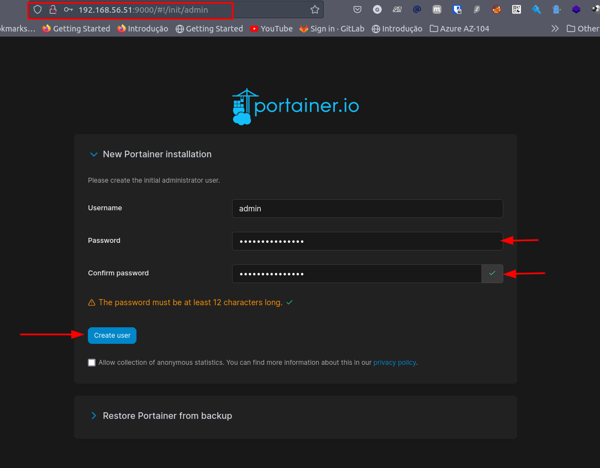

# **Laboratório de Cluster Docker Swarm**

Neste laboratório, serão configuradas 4 vms (virtual machines), utilizando o vagrant. As VMs:
- 1 VM para servidor de NFS
- 3 VMs para nodes do cluster docker swarm (1 node manager e 2 node workers)
- Sistema operacional utilizado: Oracle Linux 8


## **1. Subindo as vms com Vagrant**

1. Acessar o diretório vagrant deste repositório:

    ```shell
    cd vagrant
    ```

2. Subir as vms:

    ```shell
    vagrant up
    ```

Caso necessite ajustar algo nas vms, como por exemplo, quantidade de memória RAM ou vCPUs, utilize o arquivo [vagrant/environment.yml](vagrant/environment.yml)

## **2. Configurando o servidor NFS**

**Atenção**: É necessário adicionar um segundo disco nesta VM, que será configurado com LVM. O procedimento para isso vai variar de acordo com o virtualizador utilizado (virtualbox, vmware, hyperv, etc), consulte a documentação do virtualizador que está sendo utilizado.

Estando dentro do diretório vagrant deste repositório, execute, conecte-se via ssh na vm **nfs-server**:

```shell
vagrant ssh nfs-server 
```

O nome nfs-server foi definido no arquivo [vagrant/environment.yml](vagrant/environment.yml).

### **2.1. Configurando o LVM**

Para simular um cenário próximo do real, será configurado um volume lógico para o path que será servido via NFS para os clientes. 

Execução, como root (execute primeiramente **sudo -i**):

1. Identificando o disco adicional**

    ```shell
    fdisk -l
    ```
    No caso, o disco aqui identificado para configurar no LVM foi **/dev/sdb**.

2. Criação da partição LVM:

    ```shell
    fdisk /dev/sdb
    ``` 
    Após abrir o fdisk, basta digitar as seguintes teclas: 
    - n -> para nova partição
    - p -> para tipo primária
    - t -> para escolher um tipo
    - 8e -> para definir o tipo LVM
    - w -> para gravar as alterações e sair

    Serão solicitadas outras informações, basta ler com calma, mas em todas basta digitar Enter.

    Ao finalizar, foi criada a partição **/dev/sdb1**.

3. Criação do LVM:
    Criando o PV:
    ```shell
    pvcreate /dev/sdb1
    ```

    Criando o VG:
    ```shell
    vgcreate vg_data /dev/sdb1
    ```

    Criando o LV:
    ```shell
    lvcreate -l 100%FREE --name lv_data vg_data
    ```

4. Formatar a partição:

    ```shell
    mkfs.xfs /dev/vg_data/lv_data
    ```

5. Tornando a montagem permanente do disco
    
    Primeiro criar o diretório destino, que vai receber a montagem do LV:
    ```shell
    mkdir -p /nfs/data
    ```

    Recuperando o block id do dispositivo:
    ```shell
    [root@nfs ~]# blkid /dev/mapper/vg_data-lv_data
    /dev/mapper/vg_data-lv_data: UUID="b98deca6-47cd-4e7a-9b3b-5a9cc4857a2f" BLOCK_SIZE="512" TYPE="xfs"
    ```
    O que precisamos é **b98deca6-47cd-4e7a-9b3b-5a9cc4857a2f**. Atente para a saída, pois essa informação vai mudar no seu caso.

    Edite o arquivo /etc/fstab:
    ```shell
    vim /etc/fstab
    ```
    Adicione no final do arquivo a linha contendo o UUID recuperado no passo anterior:
    ```shell
    UUID=b98deca6-47cd-4e7a-9b3b-5a9cc4857a2f /nfs/data     xfs     defaults        0 1
    ```


### **2.2. Configuração do NFS**

1. Instalando pacotes necessários:

    ```shell
    yum install nfs-utils -y
    ```
2. Iniciando e habilitando o serviço do NFS:
    ```shell
    systemctl start nfs-server && systemctl enable nfs-server
    ```
3. Adicionando informações no **/etc/exports**:
    ```shell
    vim /etc/exports
    ```
    Adicione a seguinte linha no final do arquivo:
    ```shell
    /nfs/data 192.168.56.0/24(rw,sync,no_root_squash,no_subtree_check)
    ```
    O diretório /nfs/data é o diretório que será servido via NFS ao cluster swarm. O uso do NFS está permitido para a rede das vms 192.168.56.0/24. Para iniciar o compartilhamento, execute:

    ```shell
    exportfs -a
    ```

    Para confirmar se está tudo certo:
    ```shell
    [root@nfs ~]# showmount -e 127.0.0.1
    Export list for 127.0.0.1:
    /nfs/data 192.168.56.0/24
    ```

4. Adicionando regras no firewall:

Para que os clientes consigam conectar no NFS, é necessário adicionar as rules adequadas com o firewall-cmd:

```shell
firewall-cmd --permanent --add-service=rpc-bind
firewall-cmd --permanent --add-service=mountd
firewall-cmd --permanent --add-port=2049/tcp
firewall-cmd --permanent --add-port=2049/udp
firewall-cmd --reload
```
Por padrão o firewalld é ativado no Oracle Linux 8.

## **3. Configurando o Cluster Docker Swarm**

Antes de mais nada, é necessário instalar o docker nos hosts node01, node02 e node03.

### **3.1. Instalando pacotes úteis e necessários**

Para que consigamos trabalhar melhor e acessar o servidor NFS, alguns pacotes são necessários:

```shell
yum install epel-release -y && yum update -y && yum install wget git vim htop curl net-tools nfs-utils traceroute tcpdump rsyslog -y
```

Só para confirmar se os nodes (node01, node02 e node03) estão conseguindo enxegar o servidor NFS:

```shell
[root@node01 ~]# showmount -e 192.168.56.50
Export list for 192.168.56.50:
/nfs/data 192.168.56.0/24
```
Se for mostrada a saída acima, está tudo certo.

### **3.2. Instalando o Docker**

Acessar cada uma das VMs. Estando no diretório vagrant deste repositório:

```shell
vagrant ssh manager01
```
O ideal é ter um terminal para cada VM. Será demonstrado a instalação no node01, mas o processo é o mesmo para o node02 e node03.

1. Instalando:
    ```shell
    sudo dnf install -y dnf-utils zip unzip
    sudo dnf config-manager --add-repo=https://download.docker.com/linux/centos/docker-ce.repo
    sudo dnf remove -y runc
    sudo dnf install -y docker-ce --nobest
    ```
    Cada linha acima é uma linha de comando.

2. Habilitando e iniciando o serviço Docker:

    ```shell
    sudo systemctl enable docker.service
    sudo systemctl start docker.service
    ```

### **3.3. Iniciando o cluster swarm**

1. Criar as regras de firewall

    Para que funcione perfeitamente o cluster, nas 3 vms que vão compor o cluster, é necessário adicionar as seguintes liberações de portas:

    ```shell
    firewall-cmd --add-port=2376/tcp --permanent
    firewall-cmd --add-port=2377/tcp --permanent
    firewall-cmd --add-port=7946/tcp --permanent
    firewall-cmd --add-port=7946/udp --permanent
    firewall-cmd --add-port=4789/udp --permanent
    firewall-cmd --reload
    ```
    Acima, para restringir melhor, pode-se criar um um **ipset** com o fireall-cmd para liberar apenas para um determinado conjunto de ips ou subrede. Mais informações, consulte a documentação do firewall-cmd.

2. Na vm manager01, que será o node manager, execute:

    ```shell
    docker swarm init --advertise-addr 192.168.56.51
    ```

    Após a conclusão da execução do comandoa acima, será gerado o comando para executar nos nodes que serão workers (vms worker01 e worker02).

3. Nas vms worker01 e worker02, que serão nodes workers, execute:
    ```shell
    docker swarm join --token TOKEN_AQUI 192.168.56.51:2377
    ```

    Se precisar recuperar o token, execute:
    ```shell
    docker swarm join-token worker
    ```
    Com o comando acima é exibido o token para adicionar um node do tipo wroker. Caso necessite do token pra adicionar um manager, basta executar o mesmo comando, substituindo o worker por manager.

    Para confirmar se os nodes estão todos no cluster, na vm manager01:

    ```shell
    [root@node01 ~]# docker node ls
    ID                            HOSTNAME   STATUS    AVAILABILITY   MANAGER STATUS   ENGINE VERSION
    xhygmgk6qknmb8yhc0hasr8x0 *   node01     Ready     Active         Leader           23.0.1
    31ecipqku5pce3kb389gcvpkz     node02     Ready     Active                          23.0.1
    mwrx3zcizjgq97me6pzkf32ui     node03     Ready     Active                          23.0.1
    ```

### **3.4. Configurando cliente NFS**

Agora que os 3 nodes estão prontos, falta configurar a montagem do NFS nos nodes, no path /data. Os passos abaixo devem ser executados nas 3 vms do cluster.

1. Criar o diretório:
    ```shell
    mkdir -p /data
    ```

2. Instalando pacotes necessários e úteis que podem ser necessários posteriormente:
    ```shell
    yum install epel-release -y && yum update -y && yum install wget git vim htop curl net-tools nfs-utils traceroute tcpdump rsyslog openssl-y
    ```

3. Montando o NFS no diretório:
    ```shell
    mount -t nfs 192.168.56.50:/nfs/data /data
    ```

4. Adicionando a montagem no /etc/fstab, assim ao reiniciar o host, já será montado automaticamente no boot:
    ```shell
    vim /etc/fstab
    ```
    Adicione no final do arquivo, a seguinte linha:
    ```shell
    192.168.56.50:/nfs/data /data nfs rw,hard,intr,rsize=8192,wsize=8192,timeo=14 0 0
    ```

## **3.5. Certificado TLS/SSL autoassinado**

Agora, pode-se criar certificado TLS/SSL autoassinados do tipo wildcard (*.dominio) para utilização mais a frente se necessário, caso vá implantar em ambiente interno e queira utilizar TLS/SSL no proxy Traefik.

### **Passo-a-passo**

1. Primeiro deve-se criar a CA (Autoridade Certificadora) que será utilizada para assinar os certificados que será criados. Para tanto:
    ```shell
    openssl req -x509 -sha256 -days 3650 -nodes -newkey rsa:2048 -keyout CA.key -out CA.crt
    ```

    a. **openssl**: é o comando que executa a biblioteca OpenSSL, que fornece funções criptográficas e de segurança para várias aplicações e sistemas.

    b. **req**: indica que o comando deve ser usado para trabalhar com certificados e solicitações de certificados.

    c. **-x509**: especifica que um certificado autoassinado deve ser gerado.

    d. **-sha256**: indica que o algoritmo de hash SHA-256 deve ser usado para assinar o certificado.

    e. **-days 3650**: define a validade do certificado em dias. Neste caso, 10 anos.

    f. **-nodes**: informa que a chave privada gerada não deve ser criptografada com uma senha.

    g. **-newkey rsa:2048**: cria uma nova chave privada RSA com um comprimento de 2048 bits.

    h. **-keyout CA.key**: especifica o arquivo onde a chave privada gerada deve ser armazenada.

    i. **-out CA.crt**: especifica o arquivo onde o certificado autoassinado gerado deve ser armazenado.

2. Agora, cria-se a chave privada relacionada à identificação do servidor, identicar o próprio servidor que vai utilizar o certificado:
    ```shell
    openssl genrsa -out server.key 2048
    ```
3. Próxima etada, dev-se criar uma CSR, que é uma solicitação de assinatura de certificado, ou seja, pedindo para CA assinar o certificado que será gerado.
    ```shell
    openssl req -new -key server.key -out solicitacao.csr
    ```
    Como estamos gerando um certificado do tipo wildcard, quando for perguntado sobre qual o domínio, coloque **\*.dominio**.

    a. **openssl req**: indica que o comando deve ser usado para trabalhar com certificados e solicitações de certificados.
    
    b. **-new**: solicita a criação de uma nova solicitação de certificado.
    
    c. **-key server.key**: indica o arquivo que contém a chave privada do servidor para o qual a solicitação de certificado está sendo criada.
    
    d. **-out solicitacao.csr**: especifica o nome do arquivo que conterá a solicitação de certificado gerada.

4. Finalmente, procede-se com a criação do certificado TLS/SSL assinado pela CA criada anteriormente:
    ```shell
    openssl x509 -req -in solicitacao.csr -CA CA.crt -CAkey CA.key -CAcreateserial -out certificado.crt -days 3650 -sha256
    ```

    a. **openssl x509**: indica que o comando deve ser usado para trabalhar com certificados digitais.
    
    b. **-req**: indica que o certificado deve ser gerado a partir de uma CSR (Certificate Signing Request).
    
    c. **-in solicitacao.csr**: especifica o arquivo que contém a CSR.
    
    d. **-CA CA.crt**: especifica o arquivo que contém o certificado público da CA que será usada para assinar o certificado.
    
    e. **-CAkey CA.key**: especifica o arquivo que contém a chave privada da CA que será usada para assinar o certificado.
    
    f. **-CAcreateserial**: cria um arquivo serial com o número de série do certificado assinado.
    
    g. **-out certificado.crt**: especifica o nome do arquivo que conterá o certificado assinado gerado.
    
    h. **-days 3650**: especifica o número de dias durante os quais o certificado será válido (neste caso, 10 anos).
    
    i. **-sha256**: especifica o algoritmo de hash que deve ser usado para assinar o certificado (neste caso, SHA256).

### **3.5. Instalando o Portainer**

O Portainer é uma aplicação que permite administrar containers docker e consequentemente um cluster swarm. Para isso, acesse a vm **manager01** e siga os passos abaixo:

1. Crie o diretório que vai armazenar o volume do Portainer:
    ```shell
    mkdir -p /data/portainer_data
    ```

2. Agora crie um arquivo no diretório home do usuário root, conforme o [portainer.yml](portainer.yml).

3. Faça o deploy da stack do portainer com:
    ```shell
    docker stack deploy -c portainer.yml portainer
    ```

    Após terminar de subir a app, basta acessar no browser http://192.168.56.51:9000/

    Irá aparecer a tela abaixo, configure a senha do usuário admin e clique no botão para criar o usuário

    

    Para acessar via https: https://192.168.56.51:9443/


### **3.6. Instalando o Traefik**

O Traefik é uma solução de proxy reverso. Será utilizado no cluster swarm para gerenciar o encaminhamento de requisições para as aplicações que forem implantadas.


Implantando o Traefik. Para isso, efetue login na vm manager01, como root:

1. Criando a rede docker para o Traefik:
    ```shell
    docker network create --driver=overlay traefik_public
    ```

2. Salve em uma variável de ambiente o ID do node manager:
    ```shell
    export NODE_ID=$(docker info -f '{{.Swarm.NodeID}}')
    ```

3. Criação de uma tag no nó manager, para definir que o Traefik seja implantado sempre no mesmo nó:
    ```shell
    docker node update --label-add traefik-public.traefik-public-certificates=true $NODE_ID
    ```

4. Crie uma variável de ambiente com o e-mail que será usado para geração de certificados TLS/SSL.
    ```shell
    export EMAIL=admin@example.com
    ```

5. Crie uma variável de ambiente para guardar a url de acesso da UI do Traefik.
    ```shell
    export DOMAIN=traefik.sys.example.com
    ```
    Deve-se criar uma entrada de DNS apontando o domínio para o IP da VM manager01. Localmente, no Linux, pode-se adicionar essa entrada através do arquivo **/etc/hosts**.

6. Crie uma variável de ambiente com o usuário para autenticar na UI:
    ```shell
    export USERNAME=admin
    ```

7. Crie uma variável de ambiente para definir a senha de acesso:
    ```shell
    export PASSWORD=sua_senha_aqui
    ```

8. Utilize o openssl para gerar a hash da senha e colocar em uma variável de ambiente:
    ```shell
    export HASHED_PASSWORD=$(openssl passwd -apr1 $PASSWORD)
    ```
    Caso não possua o openssl instalado, basta executar **yum install openssl -y**.

9. Crie o diretório que abrigará o volume do Traefik, conforme definido no arquivo [traefik.yml](traefik.yml).
    ```shell
    mkdir -p /data/traefik-public-certificates
    ```

10. Subindo a stack do Traefik:
    ```shell
    docker stack deploy -c traefik.yml traefik
    ```
    Para verificar o status da implantação:
    ```shell
    docker stack ps traefik
    ```

    Depois de tudo UP, basta acessar https://traefik.SEU_DOMINIO. Será solicitada a senha criada anteriormente.